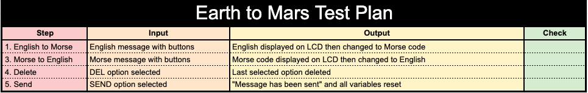
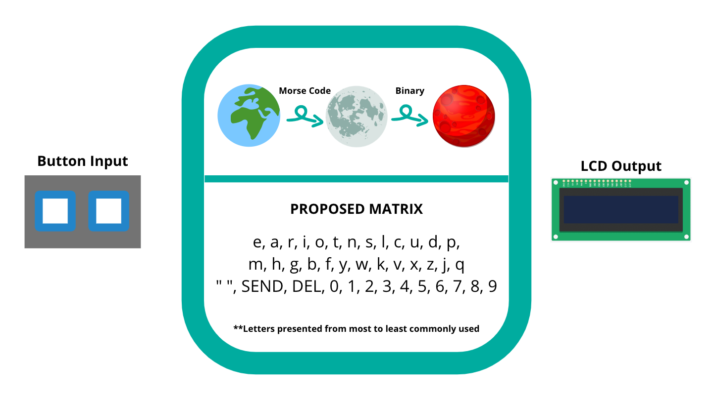

From Earth to Mars
====

Language conversion with Arduino IDE and Modern C
2
Contents
----
  1. [Planning](#planning)
  2. [Solution Overview](#overview)
  3. [Development](#development)
  4. [Evaluation](#evaluation)
  
  
Planning
---
## Definition of the problem
The year is 2050. NASA has planned a Mars expedition, and needs our help developing a communication system between the Earth and Mars. Since the two planets are so far away, they will have to transmit their communications through the moon. However, due to the lack of infrastructure in space, the following conditions apply:
* Communications between the Earth and the Moon must be done in Morse Code
* Communications between the Moon and Mars must be done in binary
* The people communicating do not know morse code or binary
* The keyboard input is limited to two button inputs

## Rationale for proposed solution
For this program, we will use the Arduino hardware and Modern C language. Before presenting our solution to NASA, we will simulate the situation by communicating with a lightbulb down a hallway. This involves dividing into three teams: Earth, the Moon, and Mars. I am on the Earth team, which means I need to be able to send and recieve messages in morse code and translate them to and from English. 

The user's needs will be met with two input buttons and an LCD display output in an arduino curcuit. Then, we will program code to translate from binary and morse code to English, and vice-versa. This is a very good solution to the problem. The arduino is a simple curciut-building hardware that has very detailed references to provide support for beginners in coding. The Modern C language is very intuitive, and has a good setup for functions that are very useful in this assignment.

The feasibility of this solution is as follows:

*Technical feasibility* - This project can be completed using the arduino hardware.
*Economic feasibility* - Since we are first modelling this software with a lightbulb at our location, developping the software will be very cheap.
*Legal feasibility* - We are working closely with NASA to make ensure that we are complying with all of their legal requirements
*Operational feasibility* - By splitting up into three teams, the project will be completed quickly. Some minor problems could be anticipated through lack of communication, so this will need to be a priority.
*Schedule feasibility* - From learning the arduino to completing the project, this should take no more than two months to complete.

## Success criteria
For the Earth team to be succcessful, it needs to meet the following criteria:
USING TWO BUTTONS...
* A message can be typed in English
* The last entered key can be deleted
* The message can be translated into morse code and shown back to the client
* The message can have the option to be "sent"
* A message can be typed in morse code
* The message can be translated to English and shown back to the client

Overview
---
## Test plan
Essentially, there are two main steps to our task:
1. An English message is converted to Morse Code
2. A Morse Code message is converted to English

In these steps, the DEL and SEND options must also be tested. 
Here is Earth's Test Plan:


Here is the General Test Plan for the whole system:

## System diagram

Here is a visual representation of the system:


Here, you can see the two buttons used to input the text. The LCD gives the user feedback for better usability so they know what they are typing. Finally, the message is sent by a flickering lightbulb.

## Flow diagrams


Development
----

What is Usability?

According to [1](#references), usability is "the extent to which a product can be used by specified users to achieve specified goals with effectiveness, efficiency, and satisfaction in a specified context of use."

Therefore, usability extends beyond the meeting of the success criteria. It is wholly dependent on the user's ability to use the product and feel confident in its functioning.

## Existing tools

The following skills must be developed in order to succcessfully complete the project:
* Using arduino (Language and Hardware)
* Using & converting numbers to and from Binary
* Understanding boolean operators 
* Using the C language
* Using functions in a code
* Using GitHub

### Learning to use Arduino

Arduino has two main components that need to be learned in order to master its use:
1. Language (Modern C)
2. Hardware (Arduino)

**Modern C**

In order to learn Modern C, we took for loops that had already been completed in bash, and translated them into Modern C. An example is shown below. Both programs have the same outputs.

*Addition Loop - Bash*
```.sh
even=0
odd=0
for (( i=1; i<1001; i++ ))
do
        (( remainder= $i % 2 ))
        if [ $remainder == 0 ]; then
                (( even=$even + $i ))
        else
                (( odd=$odd + $i ))
        fi
done

echo "The sum of the odd numbers from 1 to 1000 is $odd"
echo "The sum of the even numbers from 1 to 1000 is $even"
```
*Fig. 1* - Addition loop in bash

*Addition Loop - Modern C*
```.c
void setup()
{
   Serial.begin(9600);
}

unsigned int even = 0;
unsigned int odd = 0;

void loop()
{
  for (int i = 0; i < 1001; i++){
    if (i % 2 == 0){
      (even + i);
    }
    if (i % 2 != 0){
      (odd + i);
    }
  }
}

void print()
{
  Serial.print(even);
  Serial.print("\n");
  Serial.print(odd);
}
```
*Fig. 2* - Addition loop in Modern C

These two codes show the differences in functions, variable declarations, commands, and arithmetic operations in the two languages.

**Arduino**

In order to learn Arduino, we experimented with TinkerCad and the Arduino kits to build circuits. Below is a photo of a traffic light model we built, along with a section of the code used for it.


*Fig. 3* - Traffic light

This photo shows the traffic light circuit, one of the first circuits we built to learn about the use of arduino.

```.c
void red()
{
  digitalWrite(13, HIGH);
  delay(1000); // Wait for 1000 millisecond(s)
  digitalWrite(13, LOW);
}
```
*Fig. 4* - Traffic light code

The code shown in Fig. 4 demonstrates how to control LEDs in arduino.


*Fig. 5* - Button circuit

This shows a circuit created to use a button, a component of the arduino essential for our solution, as buttons are how we will input the message.


*Fig. 6* - LCD Circuit

This shows the standard LCD circuit provided by arduino, which we replicated in real life for an output. This circuit will have two buttons and a lightbulb added to it for our final product.

### Binary


*Fig. 7* - Binary notes

These notes show essential tables for binary and hexadeximal numbers, as well as briefly outlining the process for converting between the two, and from binary to decimal.


*Fig. 8* - Binary conversion.

This table from [2](#references) shows the conversion process from decimal to binary.

### Boolean Operators


*Fig. 9* - Boolean Notes

These notes show the process to create logic diagrams and equations with a set of conditions.

```.c
  digitalWrite(s, b | (a && ~b && c) | (~a && ~b && ~c) );
  digitalWrite(d, ~a | (a && b && c) | (~a && ~b && ~c) );
  digitalWrite(f, a | (~a && ~b && ~c) | (~a && c) );
  digitalWrite(g, (~a && ~b && ~c) | (~a && b && c) );
  digitalWrite(h, (~a && ~c) | (a && b && ~c) );
  digitalWrite(j, (a && ~b) | (a && ~c) | (~a && ~b && ~c) );
  digitalWrite(k, (~a && b) | (a && b && ~c) | (a && ~b) );
```
*Fig. 10* - Binary Counter Code

This is a portion of the code for an attempted binary counter. It shows the logic equations in action.

### C Language

The C language was not used in this project. However, we learned how to use it during the development of the software. This helped us develop our logical reasoning, and the use of different functions.

Here is one example of the C language. A complete index of our work can be found in learningC.md

```.c
```

### Functions 

Functions were paramount to the development of this solution. They were used in interruptions, to print standard messages, and to translate the input. The ["Functions"](#references) subsection of the Arduino references was used extensively to learn how to use this skill.

The flowcharts in [Design](#flow) show the logic of functions, and how they interact with one another.

### GitHub

GitHub was used in our previous assignments. It is a good place to store information, as we are able to keep muliple files and file types in one repository. The main process journal is located in this .md file. Then, codes and photos can be stored in other files in the repository. GitHub is especially useful as the entire class has access to each others' repositories. This helps us share resources and learn from each other.

Below is how my GitHub repository looks when I first log on. 

## References

(1) ISO. (n.d.). Usability of consumer products and products for public use. Retrieved from https://www.iso.org/obp/ui/#iso:std:iso:ts:20282:-2:ed-2:v1:en.
(2) Electronics Tutorials. (n.d.) Binary to Decimal and How to Convert Binary to Decimal. Retrieved from https://www.electronics-tutorials.ws/binary/bin_2.html
(3) Programing Electronics Academy. (n.d.) MULTI-DIMENSIONAL ARRAYS WITH ARDUINO (AKA MATRIX). Retrieved from https://www.programmingelectronics.com/tutorial-24-multi-dimensional-arrays-aka-matrix-old-version/
(4) “Language Reference.” Arduino Reference, www.arduino.cc/reference/en/#functions.

Evaluation
----
