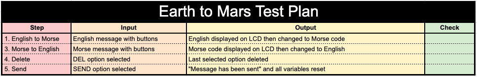
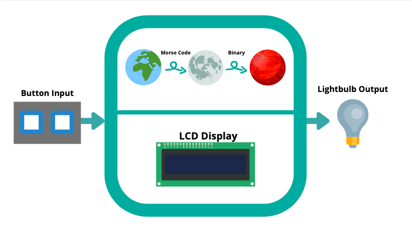
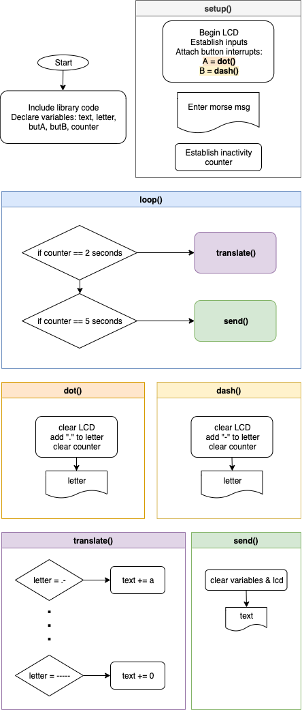
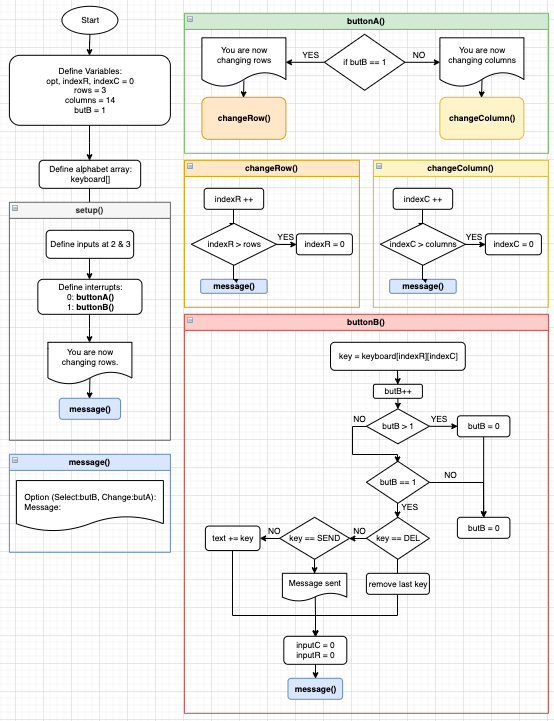
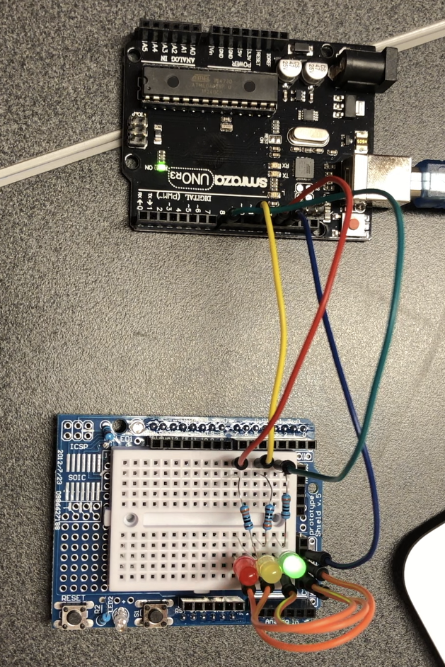
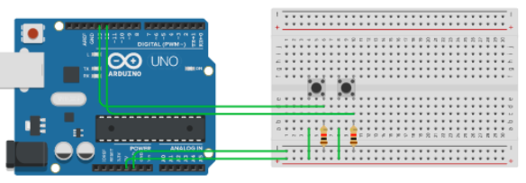
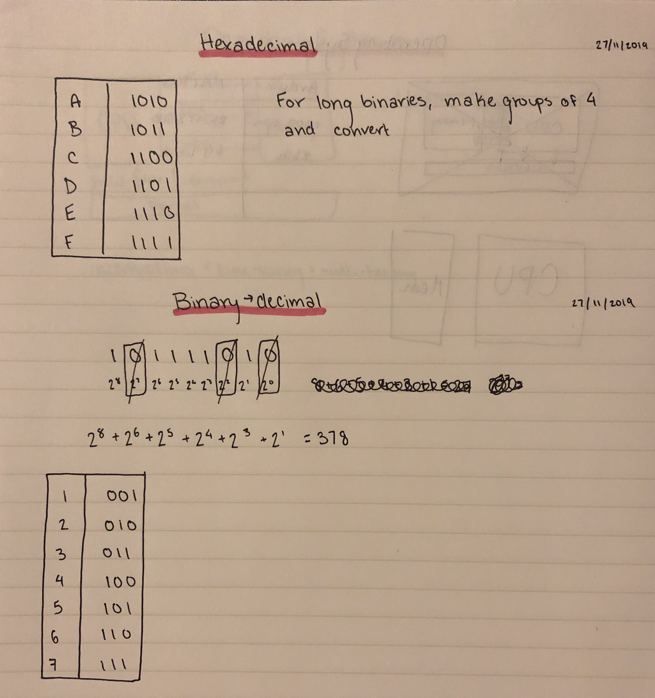
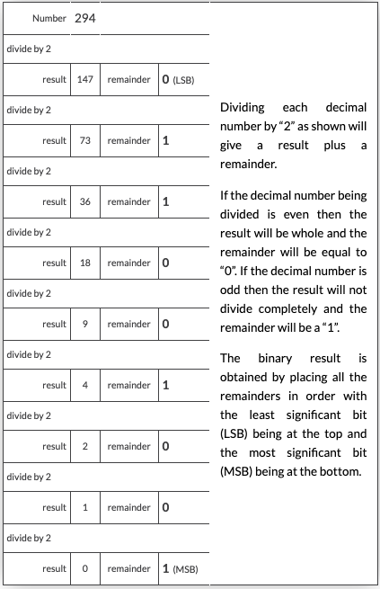
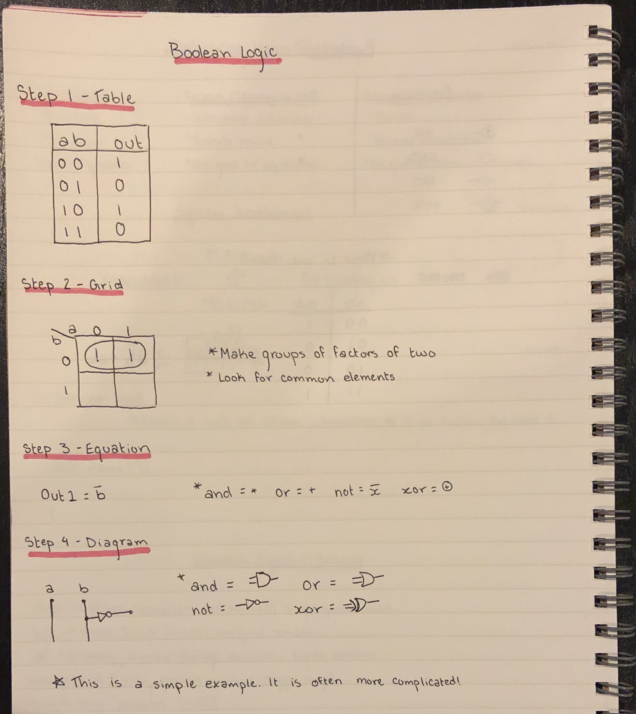
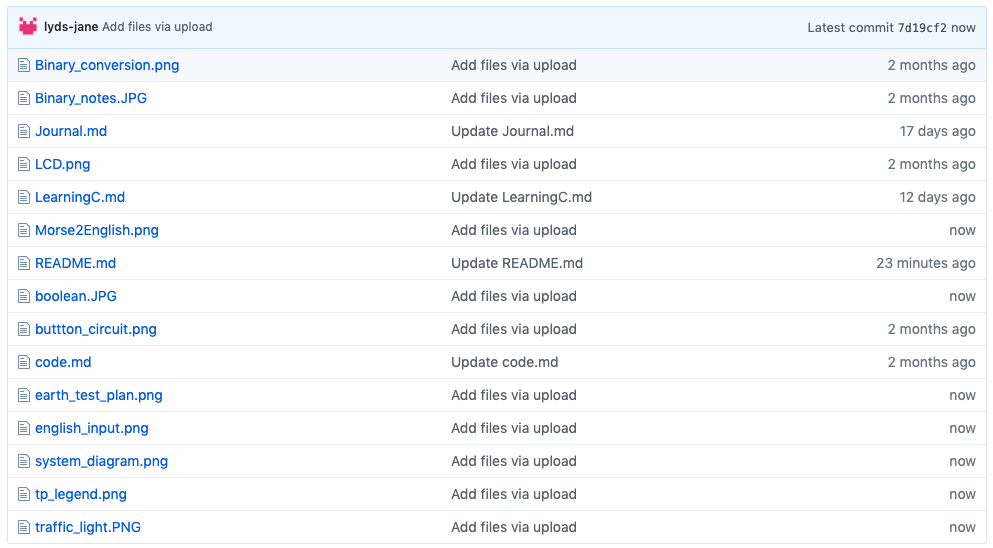

From Earth to Mars
====

Language conversion with Arduino IDE and Modern C

Contents
----
  1. [Planning](#planning)
  2. [Solution Overview](#overview)
  3. [Development](#development)
  4. [Evaluation](#evaluation)
  
  
Planning
---
## Definition of the problem
The year is 2050. NASA has planned a Mars expedition, and needs our help developing a communication system between the Earth and Mars. Since the two planets are so far away, they will have to transmit their communications through the moon. However, due to the lack of infrastructure in space, the following conditions apply:
* Communications between the Earth and the Moon must be done in Morse Code
* Communications between the Moon and Mars must be done in binary
* The people communicating do not know morse code or binary
* The keyboard input is limited to two button inputs

## Rationale for proposed solution
For this program, we will use the Arduino hardware and Modern C language. Before presenting our solution to NASA, we will simulate the situation by communicating with a lightbulb down a hallway. This involves dividing into three teams: Earth, the Moon, and Mars. I am on the Earth team, which means I need to be able to send and recieve messages in morse code and translate them to and from English. 

The user's needs will be met with two input buttons and an LCD display output in an arduino curcuit. Then, we will program code to translate from binary and morse code to English, and vice-versa. This is a very good solution to the problem. The arduino is a simple curciut-building hardware that has very detailed references to provide support for beginners in coding. The Modern C language is very intuitive, and has a good setup for functions that are very useful in this assignment.

The feasibility of this solution is as follows:

*Technical feasibility* - This project can be completed using the arduino hardware.
*Economic feasibility* - Since we are first modelling this software with a lightbulb at our location, developping the software will be very cheap.
*Legal feasibility* - We are working closely with NASA to make ensure that we are complying with all of their legal requirements
*Operational feasibility* - By splitting up into three teams, the project will be completed quickly. Some minor problems could be anticipated through lack of communication, so this will need to be a priority.
*Schedule feasibility* - From learning the arduino to completing the project, this should take no more than two months to complete.

## Success criteria
For the Earth team to be succcessful, it needs to meet the following criteria:
USING TWO BUTTONS...
* A message can be typed in English
* The last entered key can be deleted
* The message can be translated into morse code and shown back to the client
* The message can be given by a lightbulb in morse code.
* A message can be typed in morse code
* The message can be translated to English and shown back to the client

Overview
---
## Test plan
Essentially, there are two main steps to our task:
1. An English message is converted to Morse Code
2. A Morse Code message is converted to English

In these steps, the DEL and SEND options must also be tested. 
Here is Earth's Test Plan:

*Fig. 1 - Earth's test plan*
This shows the test plan for the Earth team. It goes through each of the needed functions simply.

Here is the General Test Plan for the whole system:
![FullTest](
*Fig. 2 - General test plan*
This shows the general test plan all of the teams will use. It assures that a message can be inputted and transmitted, as well as clearly recieved by the other teams.

## System diagram

Here is a visual representation of the system:

*Fig. 3 - System Diagram*
This shows the system diagram for the proposed solution. Here, you can see the two buttons used to input the text. The LCD gives the user feedback for better usability so they know what they are typing. Finally, the message is sent by a flickering lightbulb.

## Flow diagrams

The following flow diagrams are from:
1. The Morse to English program, the code I was responsible for developping for my team
2. The English to Morse program, a code the Earth team used developped by Chinomnso and Khalid
3. The English Input program I devlopped that didn't end up getting used in the final product.

**Morse to English**

*Fig. 4 - Morse to English*
This shows the Morse to Enlgish logical process. The diagram is separated into functions to show the way in which the computer jumps from one function to another, depending on the results of the interrupts and if statements.

**English to Morse**
*Fig. 5 - English to Morse by Khalid*
This shows the flow diagram for the English to Morse code. This code has an added element - the morse code must be shown on the lightbulb output.

**English Input**

*Fig. 6 - English Input*
This shows the logic behind an initial plan for an English Input system. The system was later amalgamated with the English to Morse program, so this code was not used in the end. However, I am very proud of this system, as it is very efficient from a user's standpoint. Instead of the keyboard options being in a 1-dimensional array, I created a matrix that reduced the number of clicks necessary to select a given letter. The full code is below:

```.c
/*
How it works:
Button A: Changes rows or columns
Button B: Selects & goes from rows to columns
*/

int butB = 1;
String text = "";
int indexR = 0; // the row in the matrix the user has selected
int indexC = 0; // the row in the matrix the user has selected
int rows = 3;
int columns = 14;

/*
butB counts how many times butB has been clicked.
0 = selecting a row
1 = selecting a column
*/
  
String keyboard[3][14]{
  {"Line1", "e", "a", "r", "i", "o", "t", "n", "s", "l", "c", "u", "d", "p"},
  {"Line2", "m", "h", "g", "b", "f", "y", "w", "k", "v", "x", "z", "j", "q"},
  {"Line3", " ", "SEND", "DEL", "0", "1", "2", "3", "4", "5", "6", "7", "8", "9"}
};


// Establish interrupts for one or both buttons pushed
void setup()
{
  pinMode(3, INPUT);
  pinMode(2, INPUT);
  Serial.begin(9600);
  attachInterrupt(0, buttonA, RISING);//button A in port 2
  attachInterrupt(1, buttonB, RISING);//button B in port 3 
  Serial.println("Changing rows");
  message();
}

void loop(){
}

// Determining if the user is choosing the column or row
void buttonA()
{
  if(butB == 1){
    Serial.println("Changing rows");
    changeRow();
  }
  else if(butB == 0){
    Serial.println("Changing columns");
    changeColumn();
  }
  message();
}

// Changing the row & resolving the overflow
void changeRow()
{
  indexR++;
  if(indexR > rows){
    indexR = 0;
  }
}

// Changing the column & resolving the overflow
void changeColumn()
{
  indexC++;
  if(indexC > columns){
    indexC = 0;
  }
}
  
    
// Selecting a letter
void buttonB()
{
  String key = keyboard[indexR][indexC];
  butB++;
  if(butB > 1){
    butB = 0;
  }
  else if(butB == 1){
    if(key == "DEL"){
      int len = text.length();
      text.remove(len - 1);
    }
    else if(key == "SEND"){
      Serial.println("\nMessage sent.\n\n");
      text = " ";
    }
    else{
      text += key;
    }
    indexC = 0;
    indexR = 0;
  }
  message();
}

void message()
{
  Serial.println("Yes:A No:B - " + keyboard[indexR][indexC]);
  Serial.println("Msg: " + text);
}
```

Development
----

**All of the code for this project can be found in projectCode.md

What is Usability?

According to [1](#references), usability is "the extent to which a product can be used by specified users to achieve specified goals with effectiveness, efficiency, and satisfaction in a specified context of use."

Therefore, usability extends beyond the meeting of the success criteria. It is wholly dependent on the user's ability to use the product and feel confident in its functioning.

## Existing tools

The following skills must be developed in order to succcessfully complete the project:
* Using arduino (Language and Hardware)
* Using & converting numbers to and from Binary
* Understanding boolean operators 
* Using the C language
* Using functions in a code
* Using GitHub

### Learning to use Arduino

Arduino has two main components that need to be learned in order to master its use:
1. Language (Modern C)
2. Hardware (Arduino)

**Modern C**

In order to learn Modern C, we took for loops that had already been completed in bash, and translated them into Modern C. An example is shown below. Both programs have the same outputs.

*Addition Loop - Bash*
```.sh
even=0
odd=0
for (( i=1; i<1001; i++ ))
do
        (( remainder= $i % 2 ))
        if [ $remainder == 0 ]; then
                (( even=$even + $i ))
        else
                (( odd=$odd + $i ))
        fi
done

echo "The sum of the odd numbers from 1 to 1000 is $odd"
echo "The sum of the even numbers from 1 to 1000 is $even"
```

*Addition Loop - Modern C*
```.c
void setup()
{
   Serial.begin(9600);
}

unsigned int even = 0;
unsigned int odd = 0;

void loop()
{
  for (int i = 0; i < 1001; i++){
    if (i % 2 == 0){
      (even + i);
    }
    if (i % 2 != 0){
      (odd + i);
    }
  }
}

void print()
{
  Serial.print(even);
  Serial.print("\n");
  Serial.print(odd);
}
```

These two codes show the differences in functions, variable declarations, commands, and arithmetic operations in the two languages.

**Arduino**

In order to learn Arduino, we experimented with TinkerCad and the Arduino kits to build circuits. Below is a photo of a traffic light model we built, along with a section of the code used for it.


*Fig. 7 - Traffic light*

This photo shows the traffic light circuit, one of the first circuits we built to learn about the use of arduino.

```.c
void red()
{
  digitalWrite(13, HIGH);
  delay(1000); // Wait for 1000 millisecond(s)
  digitalWrite(13, LOW);
}
```
*Fig. 8 - Traffic light code*

The code shown in Fig. 4 demonstrates how to control LEDs in arduino.


*Fig. 9 - Button circuit*

This shows a circuit created to use a button, a component of the arduino essential for our solution, as buttons are how we will input the message.


*Fig. 10 - LCD Circuit*

This shows the standard LCD circuit provided by arduino, which we replicated in real life, in addition to two buttons to use as an input. The final product also had a lightbulb added to it.

### Binary


*Fig. 11 - Binary notes*

These notes show essential tables for binary and hexadeximal numbers, as well as briefly outlining the process for converting between the two, and from binary to decimal.


*Fig. 12 - Binary conversion.*

This table from [2](#references) shows the conversion process from decimal to binary.

### Boolean Operators



*Fig. 13 - Boolean Notes*

These notes show the process to create logic diagrams and equations with a set of conditions.

This is a portion of the code for an attempted binary counter. It shows the logic equations in action:

```.c
  digitalWrite(s, b | (a && ~b && c) | (~a && ~b && ~c) );
  digitalWrite(d, ~a | (a && b && c) | (~a && ~b && ~c) );
  digitalWrite(f, a | (~a && ~b && ~c) | (~a && c) );
  digitalWrite(g, (~a && ~b && ~c) | (~a && b && c) );
  digitalWrite(h, (~a && ~c) | (a && b && ~c) );
  digitalWrite(j, (a && ~b) | (a && ~c) | (~a && ~b && ~c) );
  digitalWrite(k, (~a && b) | (a && b && ~c) | (a && ~b) );
```


### Functions 

Functions were paramount to the development of this solution. They were used in interruptions, to print standard messages, and to translate the input. The "Functions" [4](#references) subsection of the Arduino references was used extensively to learn how to use this skill.

The flowcharts in Design show the logic of functions, and how they interact with one another.

### GitHub

GitHub was used in our previous assignments. It is a good place to store information, as we are able to keep muliple files and file types in one repository. The main process journal is located in this .md file. Then, codes and photos can be stored in other files in the repository. GitHub is especially useful as the entire class has access to each others' repositories. This helps us share resources and learn from each other.

Below is how my GitHub files are organized:


## References

(1) ISO. (n.d.). Usability of consumer products and products for public use. Retrieved from https://www.iso.org/obp/ui/#iso:std:iso:ts:20282:-2:ed-2:v1:en.

(2) Electronics Tutorials. (n.d.) Binary to Decimal and How to Convert Binary to Decimal. Retrieved from https://www.electronics-tutorials.ws/binary/bin_2.html

(3) Programing Electronics Academy. (n.d.) MULTI-DIMENSIONAL ARRAYS WITH ARDUINO (AKA MATRIX). Retrieved from https://www.programmingelectronics.com/tutorial-24-multi-dimensional-arrays-aka-matrix-old-version/

(4) “Language Reference.” Arduino Reference, www.arduino.cc/reference/en/#functions.

Evaluation
----

The testing videos can be accessed here: https://drive.google.com/drive/folders/1GP54CQTwInArqjo29mlwqzjRytWH70al?usp=sharing

To evaluate this project, first, the Earth team will be evaluated through the success criteria and suggest possible improvements. Then, areas of improvement for the whole project will be identified.

### Checking Success Criteria - Earth

**A message can be typed in English**
This was a success. The message "ABC 789" was successfully typed into Earth's arduino, as noted in the Test Plan. To improve this, a more efficient input system, such as a multi-dimensional array, could have been used.

**The last entered key can be deleted**
This was also a success. When a typo was made, it was successfully deleted.

**The message can be translated into morse code and shown back to the client**
This was partially a success. The message was shown on the lightbulb, however, it was not displayed on the LCD. In order to improve this, the translated morse message could be printed on the LCD after the user selected "SEND".

**The message can be given by a lightbulb in morse code.**
This was a success. The lightbulb showed the message in morse code, with short pauses between letters and long pauses between words.

**A message can be typed in morse code**
This was a success. The morse code input was very simple with two buttons, and the user was able to see their message as they typed it. To improve this program, a button debounce function could have been added. Occaisionally, the buttons would accidentally input too many dots or dashed. A debounce function could have fixed this issue, and made the program run much smoother. Furthermore, a delete and space option should be added. Since the two buttons functionned as a dash and a dot, this was logistically difficult to create. Therefore, any typos were ignored (or forced the user to restart), and the words were translated one at a time due to the lack of a space option.

**The message can be translated to English and shown back to the client**
This was a success. The messages were translated letter by letter, and the correct message was given back to the user.

### Future Improvements - Full project

This project was an overall success. However, there are certain ways in which it could be improved. First, the teams could have communicated with each other better. It would have been ideal if we had established early on how long a dot and dash (or 0 adn 1) were, and how long of a space there is between a letter and a word. This is especially important when the two programs are used simultaneously. If someone is waiting for their code to register a letter (and is therefore unable to input anything), but the next letter is already being shown, part of the message will be missed.

Furthermore, the equipment could have been checked better. We only had one working lightbulb by the end of the assignment, and were unable to actually simulate the situation, as the lightbulb had to be transferred between one arduino and the other.

Ultimately, each individual team worked well to create a fairly successful solution to the problem.
